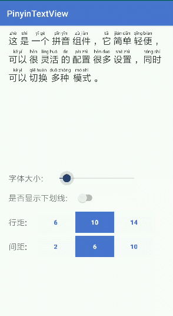

[](https://maven-badges.herokuapp.com/maven-central/com.liwenwei.pinyintextview/pinyintextview/badge.svg)

# PinyinTextView
一个简单灵活的汉语拼音Widget



## Getting started

### Setting up the dependency

首先将PinyinTextView引用到你的项目中，例如 Gradle compile dependency:
```groovy
implementation "com.liwenwei.pinyintextview:pinyintextview:1.0.0"
```

### Usage

在Activity的XML中

```xml
<com.liwenwei.pinyintextview.PinyinTextView
	android:id="@+id/ptv_content"
	android:layout_width="match_parent"
	android:layout_height="wrap_content"
	app:textSize="26dp" />
```

### XML attributes

Summary

| XML attributes  | Description |
| --- | --- |
| app:textSize  | 字体大小  |
| app:textColor  | 汉字字体颜色  |
| app:pinyinColor  | 拼音字体颜色  |
| app:pinyinTextSpace  | 汉字和拼音的上下间距  |
| app:horizontalSpace  | 每个汉字拼音之间的间距  |
| app:lineSpace  | 行距  |
| app:underlineVerticalSpace  | 下划线垂直间距  |
| app:underline  | 是否显示下划线  |

### Colors
如果你想给你不同的汉字拼音设置不同的颜色，请参考
```java
void setPinyinTextByTokens(List<Token> pinyinList, @PinyinMode int mode)
```
每个拼音对应`Token`，根据给Token设置不同的`textColor`和`pinyinColor`颜色
